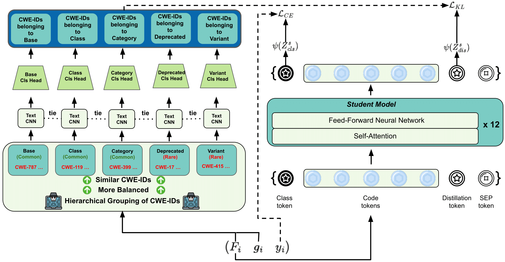

<div align="center">
  
# VulExplainer Replication of Experiments
  
</div>



<p align="center">
  </a>
  <h3 align="center">VulExplainer</h3>
  <p align="center">
    Transformer-based Distillation for Hierarchical Software Vulnerability Classification
  </p>
</p>
     
## Table of contents

<!-- Table of contents -->
<details open="open">
  <summary></summary>
  <ol>
    <li>
      <a href="#how-to-replicate">How to replicate</a>
        <ul>
          <li><a href="#environment-setup">Environment Setup</a></li>
          <li><a href="#datasets">Datasets</a></li>
          <li><a href="#replication-of-experiments">Replication of Experiments</a></li>
        </ul>
    </li>
    <li>
      <a href="#license">License</a>
    </li>
    <li>
      <a href="#citation">Citation</a>
    </li>
  </ol>
</details>

## How to replicate 

### Environment Setup
<details open="open">
  <summary></summary>
  
First of all, clone this repository to your local machine and access the main dir via the following command:
```
git clone https://github.com/VulExplainer/VulExplainer.git
cd VulExplainer
```

Then, install the python dependencies via the following command:
```
pip install -r requirements.txt
```

If having an issue with the gdown package, try the following commands:
```
git clone https://github.com/wkentaro/gdown.git
cd gdown
pip install .
cd ..
```

* We highly recommend you check out this <a href="https://pytorch.org/">installation guide</a> for the "torch" library so you can install the appropriate version on your device.
  
* To utilize GPU (optional), you also need to install the CUDA library, you may want to check out this <a href="https://docs.nvidia.com/cuda/cuda-quick-start-guide/index.html">installation guide</a>.
  
* <a href="https://www.python.org/downloads/release/python-397/">Python 3.9.7</a> is recommended, which has been fully tested without issues.
 
</details>
  
### Datasets
<details open="open">
  <summary></summary>

The data folder contain csv files to reproduce most of the methods, we introduce x specific columns that are used in our experiments:
1. "func_before": original vulnerable functions
2. "CWE ID": CWE-ID labels
3. "cwe_abstract_group": CWE abstract types 

The LFME_BAGS_data are specific to reproduce LFME and BAGS-related approaches, the data is not grouped by "cwe_abstract_group", instead, it is grouped by:
1. "label_dist": Groups split based on label frequencies, an alternative of "cwe_abstract_group" grouping.

The data was originally collected from [Big-Vul Dataset](https://github.com/ZeoVan/MSR_20_Code_vulnerability_CSV_Dataset).
  
</details>
 
### Replication of Experiments
  
  <details open="open">
    <summary></summary>
    
  Download necessary data and unzip via the following command: 
  ```
  sh download_data.sh 
  ```
  
  </details>  
  
  <details open="open">
    <summary></summary>
  
  #### Reproduce Main Results (Section 4.4.1 in the paper)
  - VulExplainer (proposed approach)
    * Inference
    ```
    cd VulExplainer/VulExplainer_GraphCodeBERT/saved_models/checkpoint-best-acc
    sh download_models.sh
    cd ../..
    sh run_test.sh
    ```
    * Retrain
    ```
    cd VulExplainer/VulExplainer_GraphCodeBERT
    sh train_teacher.sh
    sh soft_distillation.sh
    ```
  - VulExplainer-CodeBERT
    * Inference
    ```
    cd VulExplainer/VulExplainer_CodeBERT/saved_models/checkpoint-best-acc
    sh download_models.sh
    cd ../..
    sh run_test.sh
    ```
    * Retrain
    ```
    cd VulExplainer/VulExplainer_CodeBERT
    sh train_cnn_teacher.sh
    sh soft_distillation.sh
    ```
  - VulExplainer-CodeGPT
    * Inference
    ```
    cd VulExplainer/VulExplainer_CodeGPT/saved_models/checkpoint-best-acc
    sh download_models.sh
    cd ../..
    sh run_test.sh
    ```
    * Retrain
    ```
    cd VulExplainer/VulExplainer_CodeGPT
    sh train_cnn_teacher.sh
    sh soft_distillation.sh
    ```
  - Devign
    * Inference
    ```
    cd baselines/ReGVD_Devign/saved_models/checkpoint-best-acc
    sh download_models.sh
    cd ../..
    sh test_devign.sh
    ```
    * Retrain
    ```
    cd baselines/ReGVD_Devign
    sh train_devign.sh
    ```
  - ReGVD
    * Inference
    ```
    cd baselines/ReGVD_Devign/saved_models/checkpoint-best-acc
    sh download_models.sh
    cd ../..
    sh test_regvd.sh
    ```
    * Retrain
    ```
    cd baselines/ReGVD_Devign
    sh train_regvd.sh
    ```
  - CodeBERT
    * Inference
    ```
    cd baselines/CodeBERT/saved_models/checkpoint-best-acc
    sh download_models.sh
    cd ../..
    sh run_test.sh
    ```
    * Retrain
    ```
    cd baselines/CodeBERT
    sh run_train.sh
    ```
  - CodeGPT
    * Inference
    ```
    cd baselines/CodeGPT/saved_models/checkpoint-best-acc
    sh download_models.sh
    cd ../..
    sh run_test.sh
    ```
    * Retrain
    ```
    cd baselines/CodeGPT
    sh run_train.sh
    ```
  - GraphCodeBERT
    * Inference
    ```
    cd baselines/GraphCodeBERT/saved_models/checkpoint-best-acc
    sh download_models.sh
    cd ../..
    sh run_test.sh
    ```
    * Retrain
    ```
    cd baselines/GraphCodeBERT
    sh run_train.sh
    ```
  - BAGS
    * Inference
    ```
    cd baselines/BAGS/saved_models/checkpoint-best-acc
    sh download_models.sh
    cd ../..
    sh run_test.sh
    ```
    * Retrain
    ```
    cd baselines/BAGS
    sh run_train.sh
    ```
  - LFME
    * Inference
    ```
    cd baselines/LFME/saved_models/checkpoint-best-acc
    sh download_models.sh
    cd ../..
    sh run_test.sh
    ```
    * Retrain
    ```
    cd baselines/LFME
    sh train_g1_teacher.sh
    sh train_g2_teacher.sh
    sh train_g3_teacher.sh
    sh soft_distillation.sh
    ```
  </details>
 
  <details open="open">
    <summary></summary>
    
  #### Reproduce Ablation Results - Data Imbalance (Section 4.4.2-(1) in the paper)
  - GraphCodeBERT + Focal Loss
    * Inference
    ```
    cd baselines/GraphCodeBERT/saved_models/checkpoint-best-acc
    sh download_models.sh
    cd ../..
    sh run_test_fl.sh
    ```
    * Retrain
    ```
    cd baselines/GraphCodeBERT
    sh run_train_fl.sh
    ```
  - GraphCodeBERT + Logit Adjustment
    * Inference
    ```
    cd baselines/GraphCodeBERT/saved_models/checkpoint-best-acc
    sh download_models.sh
    cd ../..
    sh run_test_la.sh
    ```
    * Retrain
    ```
    cd baselines/GraphCodeBERT
    sh run_train_la.sh
    ```
  </details>  
  
  <details open="open">
    <summary></summary>
    
  #### Reproduce Ablation Results - Data Splitting (Section 4.4.2-(2)-(i) in the paper)
  - GraphCodeBERT + Label Frequency Grouping
    * Inference
    ```
    cd ablation_lfme_group/LFME_GraphCodeBERT/saved_models/checkpoint-best-acc
    sh download_models.sh
    cd ../..
    sh run_test.sh
    ```
    * Retrain
    ```
    cd ablation_lfme_group/LFME_GraphCodeBERT
    sh train_teacher.sh
    sh soft_distillation.sh
    ```
  </details>
 
  <details open="open">
  <summary></summary>
    
  #### Reproduce Ablation Results - Teacher Model (Section 4.4.2-(2)-(ii) in the paper)
  - GraphCodeBERT + Non-shared TextCNN Teachers
    * Inference
    ```
    cd ablation_non_shared_cnnteacher/Distil_GraphCodeBERT/saved_models/checkpoint-best-acc
    sh download_models.sh
    cd ../..
    sh run_test.sh
    ```
    * Retrain
    ```
    cd ablation_non_shared_cnnteacher/Distil_GraphCodeBERT
    sh train_cnn_teacher.sh
    sh soft_distillation.sh
    ```
  - GraphCodeBERT + GraphCodeBERT Teachers
    * Inference
    ```
    cd ablation_gcb_teacher/Distil_GraphCodeBERT/saved_models/checkpoint-best-acc
    sh download_models.sh
    cd ../..
    sh run_test.sh
    ```
    * Retrain
    ```
    cd ablation_gcb_teacher/Distil_GraphCodeBERT
    sh train_gcb_teacher.sh
    sh soft_distillation.sh
    ```
  </details>
  
  <details open="open">
  <summary></summary>
    
  #### Reproduce Ablation Results - Distillation Method (Section 4.4.2-(2)-(iii) in the paper)
  - GraphCodeBERT + Hard Distillation
    * Inference
    ```
    cd VulExplainer/VulExplainer_GraphCodeBERT/saved_models/checkpoint-best-acc
    sh download_models.sh
    cd ../..
    sh run_test_hard.sh
    ```
    * Retrain
    ```
    cd VulExplainer/VulExplainer_GraphCodeBERT
    sh train_teacher.sh
    sh hard_distillation.sh
    ```
  </details>
    
## License 
<a href="TODO">MIT License</a>

## Citation
```bash
under review
```
